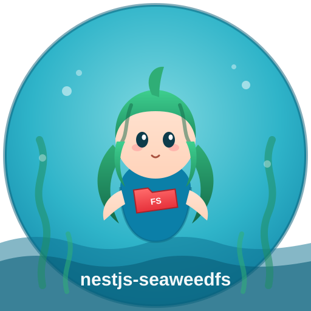

# nestjs-seaweedfs

[](LICENSE)
[](https://www.npmjs.com/package/nestjs-seaweedfs)

> **Unofficial, community-maintained** NestJS SDK for [SeaweedFS](https://github.com/seaweedfs/seaweedfs).
> Full support for both the **Filer REST API** and the **S3 Gateway API** as first-class features.
>
> Not affiliated with, endorsed by, or associated with NestJS, SeaweedFS, or their respective maintainers.

<p align="center">
  
</p>

## Features

- **Filer REST API** — upload, download, delete, list, metadata, directory management, TTL, replication, collections, volume assignment
- **S3 Gateway API** — multipart uploads, presigned URLs, bucket management, batch deletes
- **Dynamic Module** — `forRoot`, `forRootAsync` (`useFactory`/`useClass`/`useExisting`/`inject`), `register` for feature-level instances
- **Connection Validation** — validates Filer and S3 Gateway connectivity on boot
- **Retry Logic** — exponential backoff for transient failures
- **Typed Exceptions** — `SeaweedFsException` hierarchy with meaningful context
- **Escape Hatches** — raw `S3Client` and `AxiosInstance` access

## Installation

```bash
npm install nestjs-seaweedfs
```

Peer dependencies (`@nestjs/common`, `@nestjs/core`, `reflect-metadata`, `rxjs`) are typically already installed.

## Quick Start

```typescript
import { Module } from '@nestjs/common';
import { SeaweedFsModule } from 'nestjs-seaweedfs';

@Module({
  imports: [
    SeaweedFsModule.forRoot({
      filer: { url: 'http://localhost:8888' },
      s3: {
        endpoint: 'http://localhost:8333',
        accessKeyId: 'your-access-key',
        secretAccessKey: 'your-secret-key',
        forcePathStyle: true,
        defaultBucket: 'my-bucket',
      },
    }),
  ],
})
export class AppModule {}
```

```typescript
import { Injectable } from '@nestjs/common';
import { SeaweedFsService } from 'nestjs-seaweedfs';

@Injectable()
export class FileService {
  constructor(private readonly seaweed: SeaweedFsService) {}

  async uploadFile() {
    return this.seaweed.upload('/uploads/doc.pdf', Buffer.from('content'), {
      ttl: 86400,
      replication: '001',
      collection: 'documents',
    });
  }

  async s3Upload() {
    return this.seaweed.s3PutObject('my-bucket', 'key', Buffer.from('data'));
  }
}
```

## API Reference

| Method                                                 | Description                       |
| ------------------------------------------------------ | --------------------------------- |
| `upload(path, file, options?)`                         | Upload file via Filer             |
| `download(path)`                                       | Download as Readable stream       |
| `downloadToBuffer(path)`                               | Download as Buffer                |
| `delete(path, options?)`                               | Delete file                       |
| `exists(path)`                                         | Check if file/directory exists    |
| `getMetadata(path)`                                    | Get file metadata                 |
| `listDirectory(path, options?)`                        | List directory with pagination    |
| `assignVolume()`                                       | Assign a volume via Master server |
| `s3PutObject(bucket, key, body, options?)`             | Put an object                     |
| `s3GetObject(bucket, key)`                             | Get object as stream              |
| `s3GetObjectAsBuffer(bucket, key)`                     | Get object as Buffer              |
| `s3DeleteObject(bucket, key)`                          | Delete object                     |
| `s3DeleteObjects(bucket, keys)`                        | Batch delete objects              |
| `s3HeadObject(bucket, key)`                            | Get object metadata               |
| `s3ListObjects(bucket, options?)`                      | List objects with pagination      |
| `s3CopyObject(srcBucket, srcKey, destBucket, destKey)` | Copy object                       |
| `s3CreateBucket(bucket)`                               | Create bucket                     |
| `s3DeleteBucket(bucket)`                               | Delete bucket                     |
| `s3BucketExists(bucket)`                               | Check if bucket exists            |
| `s3ListBuckets()`                                      | List all buckets                  |
| `s3GetPresignedUploadUrl(bucket, key, options?)`       | Generate presigned upload URL     |
| `s3GetPresignedDownloadUrl(bucket, key, options?)`     | Generate presigned download URL   |
| `s3SetBucketPolicy(bucket, policy)`                    | Throws unsupported error          |

## Documentation

| Guide                                            | Description                                       |
| ------------------------------------------------ | ------------------------------------------------- |
| [Getting Started](docs/getting-started.md)       | Installation, peer dependencies, and verification |
| [Quick Start](docs/quick-start.md)               | Get running in under 5 minutes                    |
| [NestJS Integration](docs/nestjs-integration.md) | Module configuration, async setup, DI             |
| [Filer API](docs/filer-api.md)                   | Full Filer REST API operations reference          |
| [S3 API](docs/s3-api.md)                         | S3 Gateway operations including presigned URLs    |

## Configuration

```typescript
interface SeaweedFsModuleOptions {
  filer: { url: string; timeout?: number; retries?: number };
  masterUrl?: string;
  s3: {
    endpoint: string;
    accessKeyId: string;
    secretAccessKey: string;
    region?: string;
    forcePathStyle?: boolean;
    defaultBucket?: string;
  };
  isGlobal?: boolean;
  validateConnectionOnBoot?: boolean;
}
```

## Support

- Report issues: [GitHub Issues](https://github.com/yourscope/nestjs-seaweedfs/issues)

## License

MIT
